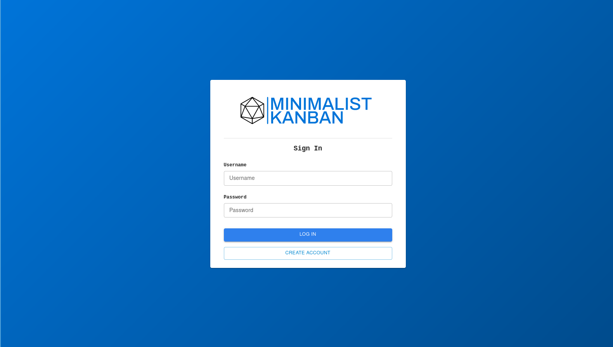
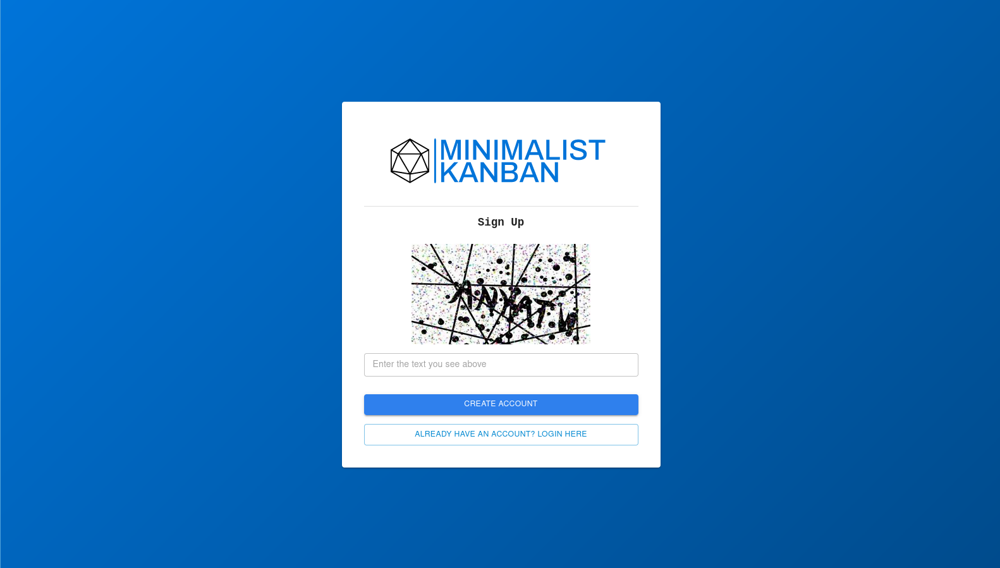
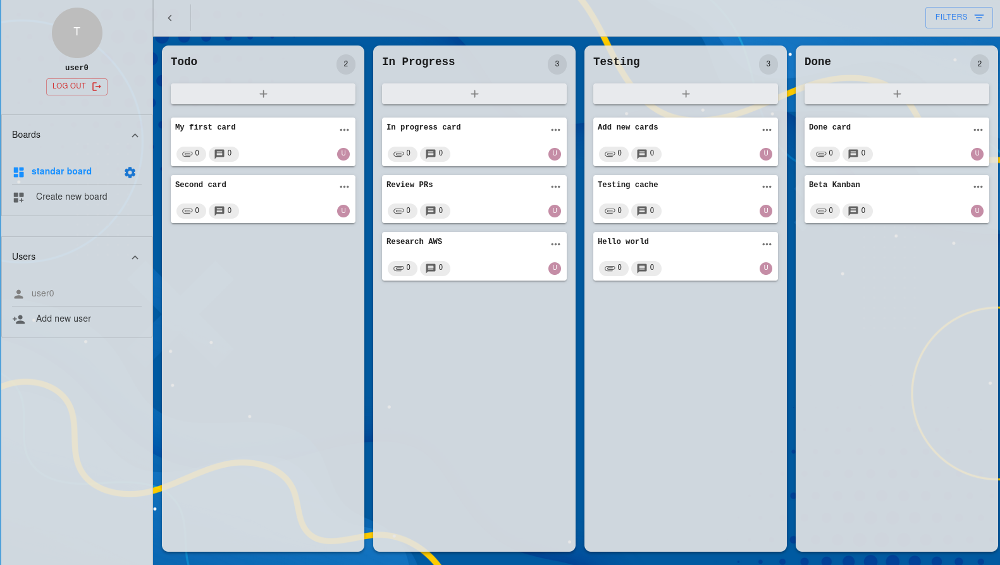
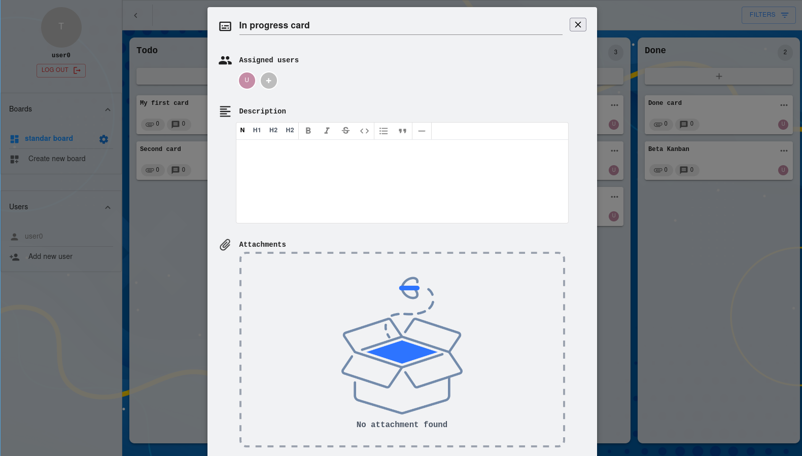

<p align="center">
  <a href="http://nestjs.com/" target="blank"></a>
</p>

  <p align="center">A progressive <a href="http://nodejs.org" target="_blank">Node.js</a> framework for building efficient and scalable server-side applications.</p>

<p align="center" float="left">
     
    
</p>

<p align="center" float="left">
    
     
</p>

## Description

Minimalist kanban webapp

## Links

[](https://github.com/AsciiCrawler/minimalist-kanban-frontend)

[](https://github.com/AsciiCrawler/minimalist-kanban-backend)

## Tech stack


## Installation

```bash
$ npm install
```
```
- copy .env.template => .env
- Change variables
```

## Running the app

```bash
# development
$ npm run start:dev

# build
$ npm run build

# production mode
$ npm run start:prod
```

## Stay in touch

[](https://www.linkedin.com/in/alfredotorresvelarde/)

[
](https://twitter.com/AsciiCrawler)

[
](https://asciicrawler.com)

## License

This project is [MIT licensed](LICENSE).
